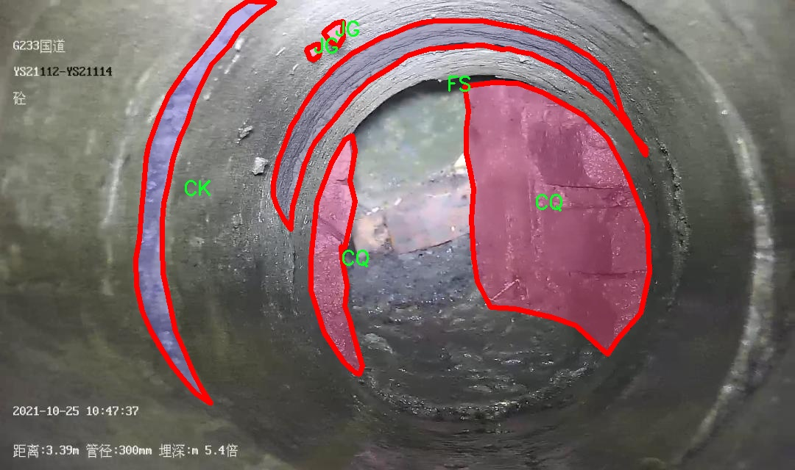
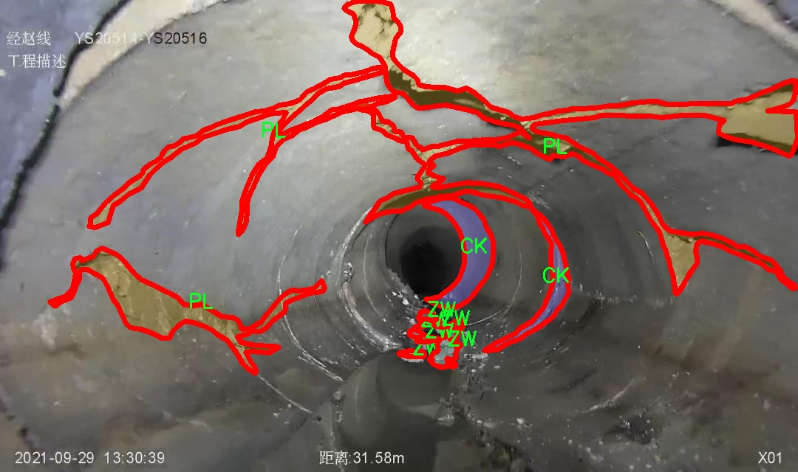

# 管道缺陷识别图像分割系统源码＆数据集分享
 [yolov8-seg-rtdetr＆yolov8-seg-C2f-DCNV2等50+全套改进创新点发刊_一键训练教程_Web前端展示]

### 1.研究背景与意义

项目参考[ILSVRC ImageNet Large Scale Visual Recognition Challenge](https://gitee.com/YOLOv8_YOLOv11_Segmentation_Studio/projects)

项目来源[AAAI Global Al lnnovation Contest](https://kdocs.cn/l/cszuIiCKVNis)

研究背景与意义

随着城市化进程的加快，地下管道系统在城市基础设施中扮演着越来越重要的角色。管道的安全性和完整性直接关系到城市的正常运行和居民的生活质量。然而，传统的管道检测方法往往依赖人工检查，效率低下且容易受到人为因素的影响，导致漏检和误检现象频发。因此，亟需一种高效、准确的自动化检测技术来识别和定位管道缺陷，以保障城市管道系统的安全和稳定运行。

近年来，深度学习技术的迅猛发展为图像处理和目标检测领域带来了新的机遇。YOLO（You Only Look Once）系列模型因其实时性和高准确率，已成为目标检测的主流方法之一。特别是YOLOv8的提出，进一步提升了检测精度和速度，使其在复杂环境下的应用潜力巨大。然而，尽管YOLOv8在目标检测方面表现出色，但在管道缺陷识别的具体应用中，仍然面临着一些挑战。例如，管道缺陷的种类繁多，形态各异，且在实际图像中常常受到光照、遮挡和噪声等因素的影响，这使得准确识别和分割变得更加困难。

为了解决上述问题，本研究提出了一种基于改进YOLOv8的管道缺陷识别图像分割系统。该系统将结合实例分割技术，通过对1500张标注图像的训练，识别出15类不同的管道缺陷，包括AJ、BX、CJ等。这些缺陷类别涵盖了管道在使用过程中可能出现的各种问题，如裂缝、腐蚀、堵塞等，具有较强的实用性和针对性。通过对这些缺陷的准确识别和分割，能够为后续的管道维护和修复提供重要的依据。

本研究的意义不仅在于技术层面的创新，更在于其对城市基础设施管理的实际应用价值。通过引入先进的深度学习算法，能够大幅提升管道缺陷检测的效率和准确性，降低人工成本和安全风险。此外，基于改进YOLOv8的图像分割系统能够实现对管道缺陷的实时监测，为城市管理者提供及时、可靠的数据支持，从而更好地制定维护和修复计划，延长管道的使用寿命，保障城市的安全运行。

综上所述，本研究在管道缺陷识别领域具有重要的理论和实践意义。通过改进YOLOv8模型，结合实例分割技术，能够有效提升管道缺陷的检测和识别能力，为城市基础设施的智能化管理提供新的解决方案。未来，随着数据集的不断扩展和模型的进一步优化，该系统有望在更广泛的应用场景中发挥作用，为智慧城市的建设贡献力量。

### 2.图片演示


##### 注意：由于此博客编辑较早，上面“2.图片演示”和“3.视频演示”展示的系统图片或者视频可能为老版本，新版本在老版本的基础上升级如下：（实际效果以升级的新版本为准）

  （1）适配了YOLOV8的“目标检测”模型和“实例分割”模型，通过加载相应的权重（.pt）文件即可自适应加载模型。

  （2）支持“图片识别”、“视频识别”、“摄像头实时识别”三种识别模式。

  （3）支持“图片识别”、“视频识别”、“摄像头实时识别”三种识别结果保存导出，解决手动导出（容易卡顿出现爆内存）存在的问题，识别完自动保存结果并导出到tempDir中。

  （4）支持Web前端系统中的标题、背景图等自定义修改，后面提供修改教程。

  另外本项目提供训练的数据集和训练教程,暂不提供权重文件（best.pt）,需要您按照教程进行训练后实现图片演示和Web前端界面演示的效果。

### 3.视频演示

[3.1 视频演示](https://www.bilibili.com/video/BV18pypYaEcN/)

### 4.数据集信息展示

##### 4.1 本项目数据集详细数据（类别数＆类别名）

nc: 15
names: ['AJ', 'BX', 'CJ', 'CK', 'CQ', 'CR', 'FS', 'FZ', 'JG', 'PL', 'SG', 'SL', 'TJ', 'TL', 'ZW']


##### 4.2 本项目数据集信息介绍

数据集信息展示

在现代计算机视觉领域，图像分割技术的进步为各种应用场景提供了强有力的支持，尤其是在管道缺陷识别的任务中，准确的图像分割能够显著提高缺陷检测的效率和准确性。本研究中，我们使用了名为“biye2”的数据集，旨在训练和改进YOLOv8-seg模型，以实现更高效的管道缺陷识别图像分割系统。

“biye2”数据集包含15个不同的类别，涵盖了管道系统中可能出现的各种缺陷类型。这些类别分别是AJ、BX、CJ、CK、CQ、CR、FS、FZ、JG、PL、SG、SL、TJ、TL和ZW。每个类别代表了一种特定的缺陷特征，例如AJ可能对应于某种特定的裂缝，BX可能代表管道的腐蚀现象，而CJ则可能是某种形式的堵塞。通过对这些类别的细致划分，数据集为模型提供了丰富的标注信息，使得YOLOv8-seg能够在训练过程中学习到每种缺陷的独特特征。

数据集的构建过程涉及了多种数据采集和标注技术，确保了数据的多样性和代表性。图像数据来源于实际的管道检测场景，涵盖了不同环境条件下的管道图像，包括光照变化、角度差异和管道材质的多样性。这种多样性使得模型在面对真实世界的应用时，能够具备更强的适应能力和鲁棒性。此外，数据集中的每张图像都经过了精确的标注，确保了训练过程中每个像素的标签信息都与实际缺陷相符，这对于图像分割任务至关重要。

在数据集的使用过程中，我们将其划分为训练集、验证集和测试集，以便于模型的训练和评估。训练集用于模型的学习过程，验证集用于调整模型参数，而测试集则用于最终的性能评估。通过这种方式，我们能够确保模型在未见数据上的泛化能力，从而提升其在实际应用中的表现。

为了进一步提高模型的性能，我们还采用了一系列数据增强技术，如随机裁剪、旋转、翻转和颜色变换等。这些技术不仅增加了训练样本的多样性，还有效地防止了模型的过拟合现象，使得YOLOv8-seg在面对不同类型的管道缺陷时，能够保持较高的识别准确率。

总之，“biye2”数据集为管道缺陷识别图像分割系统的训练提供了坚实的基础。通过对15个类别的精细划分和丰富的图像数据，结合先进的YOLOv8-seg模型，我们期望能够在管道检测领域实现更高的准确性和效率，为相关行业的智能化发展贡献力量。随着技术的不断进步，未来我们将继续扩展和优化数据集，以适应日益复杂的应用需求，推动管道缺陷识别技术的进一步发展。







### 5.全套项目环境部署视频教程（零基础手把手教学）

[5.1 环境部署教程链接（零基础手把手教学）](https://www.bilibili.com/video/BV1jG4Ve4E9t/?vd_source=bc9aec86d164b67a7004b996143742dc)


[5.2 安装Python虚拟环境创建和依赖库安装视频教程链接（零基础手把手教学）](https://www.bilibili.com/video/BV1nA4VeYEze/?vd_source=bc9aec86d164b67a7004b996143742dc)

### 6.手把手YOLOV8-seg训练视频教程（零基础小白有手就能学会）

[6.1 手把手YOLOV8-seg训练视频教程（零基础小白有手就能学会）](https://www.bilibili.com/video/BV1cA4VeYETe/?vd_source=bc9aec86d164b67a7004b996143742dc)


按照上面的训练视频教程链接加载项目提供的数据集，运行train.py即可开始训练



     Epoch   gpu_mem       box       obj       cls    labels  img_size
     1/200     0G   0.01576   0.01955  0.007536        22      1280: 100%|██████████| 849/849 [14:42<00:00,  1.04s/it]
               Class     Images     Labels          P          R     mAP@.5 mAP@.5:.95: 100%|██████████| 213/213 [01:14<00:00,  2.87it/s]
                 all       3395      17314      0.994      0.957      0.0957      0.0843

     Epoch   gpu_mem       box       obj       cls    labels  img_size
     2/200     0G   0.01578   0.01923  0.007006        22      1280: 100%|██████████| 849/849 [14:44<00:00,  1.04s/it]
               Class     Images     Labels          P          R     mAP@.5 mAP@.5:.95: 100%|██████████| 213/213 [01:12<00:00,  2.95it/s]
                 all       3395      17314      0.996      0.956      0.0957      0.0845

     Epoch   gpu_mem       box       obj       cls    labels  img_size
     3/200     0G   0.01561    0.0191  0.006895        27      1280: 100%|██████████| 849/849 [10:56<00:00,  1.29it/s]
               Class     Images     Labels          P          R     mAP@.5 mAP@.5:.95: 100%|███████   | 187/213 [00:52<00:00,  4.04it/s]
                 all       3395      17314      0.996      0.957      0.0957      0.0845


### 7.50+种全套YOLOV8-seg创新点代码加载调参视频教程（一键加载写好的改进模型的配置文件）

[7.1 50+种全套YOLOV8-seg创新点代码加载调参视频教程（一键加载写好的改进模型的配置文件）](https://www.bilibili.com/video/BV1Hw4VePEXv/?vd_source=bc9aec86d164b67a7004b996143742dc)

### 8.YOLOV8-seg图像分割算法原理

原始YOLOv8-seg算法原理

YOLOv8-seg算法是YOLO系列的最新进展，结合了目标检测与语义分割的优势，旨在实现更高效、更准确的图像理解。该算法在YOLOv8的基础上，进一步扩展了其功能，采用了一系列创新的技术和结构设计，以适应复杂的视觉任务。YOLOv8-seg不仅能够识别图像中的目标，还能够对目标进行精确的像素级分割，从而为后续的图像分析和处理提供更为丰富的信息。

首先，YOLOv8-seg算法的核心在于其网络结构的设计。该算法使用了C2f模块替代了YOLOv5中的C3模块，这一改进使得特征提取过程更加高效。C2f模块通过将特征提取分为卷积和连接两部分，能够更好地捕捉图像中的多层次特征。这种结构不仅提升了模型的表达能力，还有效减少了计算量，确保了在保持高精度的同时，模型的运行速度得以提升。

在特征提取的过程中，YOLOv8-seg采用了CSP结构，进一步优化了特征的提取过程。CSP结构通过将特征图分为两部分，分别进行卷积和连接，增强了特征的多样性和丰富性。末尾的SPPF模块则负责提升模型的计算速度，确保在处理高分辨率图像时，依然能够保持实时性。这一系列的结构设计，使得YOLOv8-seg在特征提取上具备了更强的能力，能够有效应对复杂的视觉场景。

在特征融合方面，YOLOv8-seg采用了PAN-FPN网络结构，旨在实现多尺度特征的有效融合。特征金字塔网络（FPN）与路径聚合网络（PAN）的结合，使得模型能够在不同尺度上提取和融合特征信息。这种设计不仅提高了模型对不同尺寸目标的检测能力，还增强了模型在复杂场景下的鲁棒性。此外，YOLOv8-seg引入了BiFPN网络，进一步提升了特征融合的效率。BiFPN通过高效的双向跨尺度连接和加权特征融合，能够快速整合来自不同层次的特征信息，确保模型在进行目标检测和分割时，能够获得全面的上下文信息。

YOLOv8-seg在检测网络方面采用了Anchor-Free的检测方式，这一创新的设计使得模型在处理目标时，不再依赖于预设的锚框，从而减少了锚框选择的复杂性。检测模块使用了解耦头结构，能够更灵活地处理目标的分类和定位任务。这种解耦的设计使得模型在面对多类目标时，能够更加高效地进行分类和定位，提高了检测的准确性。

在损失函数的设计上，YOLOv8-seg使用了CloU损失函数，这一损失函数在处理目标检测和分割任务时，能够更好地平衡分类和定位的损失，确保模型在训练过程中能够快速收敛，并在测试时展现出优异的性能。CloU损失函数的引入，使得YOLOv8-seg在面对复杂场景时，能够更好地应对目标的遮挡、变形等问题，提升了模型的整体表现。

YOLOv8-seg算法的轻量化设计也是其一大亮点。通过对网络结构的优化，YOLOv8-seg在保持高精度的同时，显著降低了模型的计算复杂度。这一设计使得YOLOv8-seg能够在资源受限的设备上运行，扩展了其应用场景，包括移动设备、嵌入式系统等。这种轻量化的特性，使得YOLOv8-seg不仅适用于学术研究，也能够广泛应用于工业界的实际场景中。

综上所述，YOLOv8-seg算法通过一系列创新的结构设计和技术改进，成功地将目标检测与语义分割结合在一起，展现出强大的图像理解能力。其在特征提取、特征融合、检测方式及损失函数等方面的优化，使得YOLOv8-seg在复杂视觉任务中具备了更高的准确性和效率。这一算法的提出，不仅为目标检测和分割领域带来了新的思路，也为未来的研究和应用提供了广阔的空间。随着YOLOv8-seg的不断发展和完善，我们有理由相信，它将在计算机视觉的各个领域发挥越来越重要的作用。


### 9.系统功能展示（检测对象为举例，实际内容以本项目数据集为准）

图9.1.系统支持检测结果表格显示

  图9.2.系统支持置信度和IOU阈值手动调节

  图9.3.系统支持自定义加载权重文件best.pt(需要你通过步骤5中训练获得)

  图9.4.系统支持摄像头实时识别

  图9.5.系统支持图片识别

  图9.6.系统支持视频识别

  图9.7.系统支持识别结果文件自动保存

  图9.8.系统支持Excel导出检测结果数据


### 10.50+种全套YOLOV8-seg创新点原理讲解（非科班也可以轻松写刊发刊，V11版本正在科研待更新）

#### 10.1 由于篇幅限制，每个创新点的具体原理讲解就不一一展开，具体见下列网址中的创新点对应子项目的技术原理博客网址【Blog】：


[10.1 50+种全套YOLOV8-seg创新点原理讲解链接](https://gitee.com/qunmasj/good)

#### 10.2 部分改进模块原理讲解(完整的改进原理见上图和技术博客链接)【如果此小节的图加载失败可以通过CSDN或者Github搜索该博客的标题访问原始博客，原始博客图片显示正常】
### YOLOv8简介
根据官方描述，Yolov8是一个SOTA模型，它建立在Yolo系列历史版本的基础上，并引入了新的功能和改进点，以进一步提升性能和灵活性，使其成为实现目标检测、图像分割、姿态估计等任务的最佳选择。其具体创新点包括一个新的骨干网络、一个新的Ancher-Free检测头和一个新的损失函数，可在CPU到GPU的多种硬件平台上运行。
此外，Yolov8还有一个特点就是可扩展性，ultralytics没有直接将开源库命名为Yolov8，而是直接使用"ultralytcs"，将其定位为算法框架，而非某一个特定算法。这也使得Yolov8开源库不仅仅能够用于Yolo系列模型，而且能够支持非Yolo模型以及分类分割姿态估计等各类任务。
总而言之，Yolov8是Yolo系列模型的最新王者，各种指标全面超越现有对象检测与实例分割模型，借鉴了Yolov5、Yolov6、YoloX等模型的设计优点，在全面提升改进Yolov5模型结构的基础上实现，同时保持了Yolov5工程化简洁易用的优势。

#### Yolov8创新点
Yolov8主要借鉴了Yolov5、Yolov6、YoloX等模型的设计优点，其本身创新点不多，偏重在工程实践上，具体创新如下:
·提供了一个全新的SOTA模型（包括P5 640和P6 1280分辨率的目标检测网络和基于YOLACT的实例分割模型)。并且，基于缩放系数提供了N/S/M/L/X不同尺度的模型，以满足不同部署平台和应用场景的需求。
. Backbone:同样借鉴了CSP模块思想，不过将Yolov5中的C3模块替换成了C2f模块
实现了进—步轻量化，同时沿用Yolov5中的
SPPF模块，并对不同尺度的模型进行精心微调，不再是无脑式一套参数用于所有模型，大幅提升了模型性能。
。Neck:继续使用PAN的思想，但是通过对比YOLOv5与YOLOv8的结构图可以看到，YOLOv8移除了1*1降采样层。
·Head部分相比YOLOv5改动较大，Yolov8换成了目前主流的解耦头结构(Decoupled-Head)，将分类和检测头分离，同时也从Anchor-Based换成了Anchor-Free。
·Loss计算:使用VFLLoss作为分类损失(实际训练中使用BCE Loss);使用DFLLoss+CIOU Loss作为回归损失。
。标签分配: Yolov8抛弃了以往的loU分配或者单边比例的分配方式，而是采用Task-Aligned Assigner正负样本分配策略。
#### Yolov8网络结构
Yolov8模型网络结构图如下图所示。


### Diverse Branch Block简介
参考该博客提出的一种通用的卷积网络构造块用来在不增加任何推理时间的前提下提升卷积网络的性能。我们将这个块命名为分离分支块（Diverse Branch Block）。通过结合不同尺寸和复杂度的分离分支（包括串联卷积、多尺度卷积和平均池化层）来增加特征空间的方法，它提升了单个卷积的表达能力。完成训练后，一个DBB(Diverse Branch Block)可以被等价地转换为一个单独的卷积操作以方便部署。不同于那些新颖的卷积结构的改进方式，DBB让训练时微结构复杂化同时维持大规模结构，因此我们可以将它作为任意结构中通用卷积层的一种嵌入式替代形式。通过这种方式，我们能够将模型训练到一个更高的表现水平，然后在推理时转换成原始推理时间的结构。

 
主要贡献点：

（1） 我们建议合并大量的微结构到不同的卷积结构中来提升性能，但是维持原始的宏观结构。

（2）我们提出DBB，一个通用构造块结构，概括六种转换来将一个DBB结构转化成一个单独卷积，因为对于用户来说它是无损的。

（3）我们提出一个Inception-like DBB结构实例(Fig 1)，并且展示它在ImageNet、COCO detection 和CityScapes任务中获得性能提升。


#### 结构重参数化
本文和一个并发网络RepVGG[1]是第一个使用结构重参数化来命名该思路------使用从其他结构转化来的参数确定当前结构的参数。一个之前的工作ACNet[2]也可以被划分为结构重参数化，它提出使用非对称卷积块来增强卷积核的结构（i.e 十字形结构）。相比于DBB，它被设计来提升卷积网络（在没有额外推理时间损失的条件下）。这个流水线也包含将一个训练好的模型转化为另一个。但是，ACNet和DBB的区别是：ACNet的思想被激发是基于一个观察，这个观察是网络结构的参数在过去有更大的量级，因此寻找方法让参数量级更大，然而我们关注一个不同的点。我们发现 平均池化、1x1 conv 和 1x1-kxk串联卷积是更有效的，因为它们提供了不同复杂度的路线，以及允许使用更多训练时非线性化。除此以外，ACB结构可以看作是DBB结构的一种特殊形式，因为那个1xk和kx1卷积层能够被扩大成kxk（via Transform VI(Fig.2)），然后合并成一个平方核（via Transform II）。

 

#### 分离分支结构
卷积的线性性
一个卷积操作可以表示为 ，其中为输入tensor, 为输出tensor。卷积核表示为一个四阶tensor , 偏置为。将加偏置的操作表示为。

因为，在第j个输出通道（h,w）位置的值可以由以下公式给出：，其中表示输入帧I的第c个通道上的一个滑动窗，对应输出帧O的坐标（h,w）。从上式可以看出，卷积操作具有齐次性和加法性。


注意：加法性成立的条件是两个卷积具有相同的配置（即通道数、核尺寸、步长和padding等）。

#### 分离分支的卷积
在这一小节，我们概括六种转换形式（Fig.2）来转换一个具有batch normalization(BN)、branch addition、depth concatenation、multi-scale operations、avarage pooling 和 sequences of convolutions的DBB分支。


Transform I：a conv for conv-BN  我们通常会给一个卷积配备配备一个BN层，它执行逐通道正则化和线性尺度放缩。设j为通道索引，分别为累积的逐通道均值和标准差，分别为学习的尺度因子和偏置项，对应输出通道j为


卷积的齐次性允许我们融合BN操作到前述的conv来做推理。在实践中，我们仅仅建立一个拥有卷积核和偏置, 用从原始BN序列的参数转换来的值来赋值。我们为每个输出通道j构造


Transform II a conv for branch addition  卷积的加法性确保如果有两个或者多个具有相同配置的卷积层相加，我们能够将它们合并到一个单独的卷积里面。对于conv-BN，我们应该首先执行Transform I。很明显的，通过下面的公式我们能够合并两个卷积


上述公式只有在两个卷积拥有相同配置时才成立。尽管合并上述分支能够在一定程度上增强模型，我们希望结合不同分支来进一步提升模型性能。在后面，我们介绍一些分支的形式，它们能够等价地被转化为一个单独的卷积。在通过多个转化来为每一个分支构造KxK的卷积之后，我们使用Transform II 将所有分支合并到一个conv里面。

Transform III: a conv for sequential convolutions   我们能够合并一个1x1 conv-BN-kxk conv序列到一个kxk conv里面。我们暂时假设卷积是稠密的（即 组数 groups=1）。组数groups>1的情形将会在Transform IV中实现。我们假定1x1和kxk卷积层的核形状分别是DxCx1x1和ExDxKxK，这里D指任意值。首先，我们将两个BN层融合到两个卷积层里面，由此获得。输出是


我们期望用一个单独卷积的核和偏置来表达，设, 它们满足。对方程（8）应用卷积的加法性，我们有


因为是一个1x1 conv，它只执行逐通道线性组合，没有空间聚合操作。通过线性重组KxK卷积核中的参数，我们能够将它合并到一个KxK的卷积核里面。容易证明的是，这样的转换可以由一个转置卷积实现：


其中是由转置获得的tensor张量。方程（10）的第二项是作用于常量矩阵上的卷积操作，因此它的输出也是一个常量矩阵。用表达式来说明，设是一个常数矩阵，其中的每个元素都等于p。*是一个2D 卷积操作，W为一个2D 卷积核。转换结果就是一个常量矩阵，这个常量矩阵是p 与 所有核元素之和 的乘积，即


基于以上观察，我们构造。然后，容易证明。

因此我们有

显而易见地，对于一个zero-pads 的KxK卷积，方程（8）并不成立，因为并不对的结果做卷积操作(如果有一个零元素的额外的圈，方程（8）成立)。解决方案有A)用padding配置第一个卷积，第二个卷积不用，B)通过做pad操作。后者的一个有效实现是定制第一个BN层，为了（1）如通常的batch-normalize输入。（2）计算(通过方程（6）)。（3）用  pad batch-normalized结果，例如 用一圈 pad 每一个通道j 。

Transform IV: a conv for depth concatenation  Inception 单元使用深度concatenation来组合不同分支。当每个分支都只包含一个相同配置的卷积时，深度concatenation等价于一个卷积，它的核在不同的输出通道上concatenation（比如我们公式中的第一个轴）假设。我们concatenate它们到。显然地


Transform IV 可以非常方便地将Transform III 扩展到 groupwise（即 groups > 1） 的情景。直觉上，一个groupwise 卷积将输入分割成g个并行的组，单独卷积它们，然后concatenate形成输出。为了代替g-group卷积，我们建立一个DBB结构，这个结构的所有卷积层有相同的组g。为了转换一个1x1-KxK序列，我们等价地分割它们成为g组，单独执行Transform III, 然后concatenate获得输出（如图Fig3所示）。


Transform V: a conv for average pooling  一个作用于C通道的核尺寸为K，步长为s的平均池化层等价于一个拥有相同核尺寸K,步长s的卷积层。这样的核可以被构造为

  


就像一个通常的平均池化操作，当s>1时执行降采样操作，当s=1时保持相同尺寸。

Transform VI: a conv for multi-scale convolutions   考虑一个等价于一个拥有相同zero padding的 核。特别地，卷积是格外实用的，因为它们能够有效实现。应该对输入作pad操作来对齐滑动窗。


### 11.项目核心源码讲解（再也不用担心看不懂代码逻辑）

#### 11.1 ultralytics\trackers\utils\gmc.py

以下是对代码中最核心部分的提取和详细注释：

```python
import cv2
import numpy as np
from ultralytics.utils import LOGGER

class GMC:
    """
    通用运动补偿（GMC）类，用于视频帧中的跟踪和物体检测。

    该类提供了基于多种跟踪算法（包括ORB、SIFT、ECC和稀疏光流）进行物体跟踪和检测的方法。
    还支持对帧进行下采样以提高计算效率。
    """

    def __init__(self, method='sparseOptFlow', downscale=2):
        """初始化GMC对象，指定跟踪方法和下采样因子。"""
        self.method = method  # 跟踪方法
        self.downscale = max(1, int(downscale))  # 下采样因子，确保至少为1

        # 根据选择的跟踪方法初始化相应的检测器和匹配器
        if self.method == 'orb':
            self.detector = cv2.FastFeatureDetector_create(20)
            self.extractor = cv2.ORB_create()
            self.matcher = cv2.BFMatcher(cv2.NORM_HAMMING)
        elif self.method == 'sift':
            self.detector = cv2.SIFT_create(nOctaveLayers=3, contrastThreshold=0.02, edgeThreshold=20)
            self.extractor = cv2.SIFT_create(nOctaveLayers=3, contrastThreshold=0.02, edgeThreshold=20)
            self.matcher = cv2.BFMatcher(cv2.NORM_L2)
        elif self.method == 'ecc':
            self.warp_mode = cv2.MOTION_EUCLIDEAN
            self.criteria = (cv2.TERM_CRITERIA_EPS | cv2.TERM_CRITERIA_COUNT, 5000, 1e-6)
        elif self.method == 'sparseOptFlow':
            self.feature_params = dict(maxCorners=1000, qualityLevel=0.01, minDistance=1, blockSize=3)
        elif self.method in ['none', 'None', None]:
            self.method = None
        else:
            raise ValueError(f'Error: Unknown GMC method:{method}')

        # 初始化状态变量
        self.prevFrame = None  # 存储前一帧
        self.prevKeyPoints = None  # 存储前一帧的关键点
        self.prevDescriptors = None  # 存储前一帧的描述符
        self.initializedFirstFrame = False  # 标记是否已处理第一帧

    def apply(self, raw_frame, detections=None):
        """根据指定的方法对原始帧应用物体检测。"""
        if self.method in ['orb', 'sift']:
            return self.applyFeatures(raw_frame, detections)  # 使用特征方法
        elif self.method == 'ecc':
            return self.applyEcc(raw_frame, detections)  # 使用ECC方法
        elif self.method == 'sparseOptFlow':
            return self.applySparseOptFlow(raw_frame, detections)  # 使用稀疏光流方法
        else:
            return np.eye(2, 3)  # 返回单位矩阵

    def applyEcc(self, raw_frame, detections=None):
        """应用ECC算法进行运动补偿。"""
        height, width, _ = raw_frame.shape
        frame = cv2.cvtColor(raw_frame, cv2.COLOR_BGR2GRAY)  # 转换为灰度图
        H = np.eye(2, 3, dtype=np.float32)  # 初始化变换矩阵

        # 下采样图像
        if self.downscale > 1.0:
            frame = cv2.resize(frame, (width // self.downscale, height // self.downscale))

        # 处理第一帧
        if not self.initializedFirstFrame:
            self.prevFrame = frame.copy()  # 复制当前帧作为前一帧
            self.initializedFirstFrame = True  # 标记已初始化第一帧
            return H

        # 运行ECC算法
        try:
            (cc, H) = cv2.findTransformECC(self.prevFrame, frame, H, self.warp_mode, self.criteria, None, 1)
        except Exception as e:
            LOGGER.warning(f'WARNING: find transform failed. Set warp as identity {e}')

        return H

    def applyFeatures(self, raw_frame, detections=None):
        """应用特征检测方法（如ORB或SIFT）。"""
        height, width, _ = raw_frame.shape
        frame = cv2.cvtColor(raw_frame, cv2.COLOR_BGR2GRAY)  # 转换为灰度图
        H = np.eye(2, 3)  # 初始化变换矩阵

        # 下采样图像
        if self.downscale > 1.0:
            frame = cv2.resize(frame, (width // self.downscale, height // self.downscale))

        # 检测关键点
        keypoints = self.detector.detect(frame, None)

        # 计算描述符
        keypoints, descriptors = self.extractor.compute(frame, keypoints)

        # 处理第一帧
        if not self.initializedFirstFrame:
            self.prevFrame = frame.copy()  # 复制当前帧作为前一帧
            self.prevKeyPoints = copy.copy(keypoints)  # 复制关键点
            self.prevDescriptors = copy.copy(descriptors)  # 复制描述符
            self.initializedFirstFrame = True  # 标记已初始化第一帧
            return H

        # 匹配描述符
        knnMatches = self.matcher.knnMatch(self.prevDescriptors, descriptors, 2)

        # 过滤匹配
        matches = []
        spatialDistances = []
        maxSpatialDistance = 0.25 * np.array([width, height])

        for m, n in knnMatches:
            if m.distance < 0.9 * n.distance:  # 过滤不好的匹配
                spatialDistance = (self.prevKeyPoints[m.queryIdx].pt[0] - keypoints[m.trainIdx].pt[0],
                                   self.prevKeyPoints[m.queryIdx].pt[1] - keypoints[m.trainIdx].pt[1])
                if (np.abs(spatialDistance[0]) < maxSpatialDistance[0]) and \
                        (np.abs(spatialDistance[1]) < maxSpatialDistance[1]):
                    spatialDistances.append(spatialDistance)
                    matches.append(m)

        # 计算刚性变换矩阵
        if len(matches) > 4:
            H, inliers = cv2.estimateAffinePartial2D(prevPoints, currPoints, cv2.RANSAC)
        else:
            LOGGER.warning('WARNING: not enough matching points')

        # 存储到下一次迭代
        self.prevFrame = frame.copy()
        self.prevKeyPoints = copy.copy(keypoints)
        self.prevDescriptors = copy.copy(descriptors)

        return H

    def applySparseOptFlow(self, raw_frame, detections=None):
        """应用稀疏光流方法进行运动补偿。"""
        height, width, _ = raw_frame.shape
        frame = cv2.cvtColor(raw_frame, cv2.COLOR_BGR2GRAY)  # 转换为灰度图
        H = np.eye(2, 3)  # 初始化变换矩阵

        # 下采样图像
        if self.downscale > 1.0:
            frame = cv2.resize(frame, (width // self.downscale, height // self.downscale))

        # 查找关键点
        keypoints = cv2.goodFeaturesToTrack(frame, mask=None, **self.feature_params)

        # 处理第一帧
        if not self.initializedFirstFrame:
            self.prevFrame = frame.copy()  # 复制当前帧作为前一帧
            self.prevKeyPoints = copy.copy(keypoints)  # 复制关键点
            self.initializedFirstFrame = True  # 标记已初始化第一帧
            return H

        # 计算光流
        matchedKeypoints, status, err = cv2.calcOpticalFlowPyrLK(self.prevFrame, frame, self.prevKeyPoints, None)

        # 仅保留好的匹配
        prevPoints = []
        currPoints = []
        for i in range(len(status)):
            if status[i]:
                prevPoints.append(self.prevKeyPoints[i])
                currPoints.append(matchedKeypoints[i])

        # 计算刚性变换矩阵
        if len(prevPoints) > 4:
            H, inliers = cv2.estimateAffinePartial2D(prevPoints, currPoints, cv2.RANSAC)
        else:
            LOGGER.warning('WARNING: not enough matching points')

        # 存储到下一次迭代
        self.prevFrame = frame.copy()
        self.prevKeyPoints = copy.copy(keypoints)

        return H
```

### 代码核心部分分析
1. **类初始化 (`__init__`)**: 选择跟踪方法并初始化相关的检测器和匹配器，同时设置状态变量。
2. **应用方法 (`apply`)**: 根据选择的跟踪方法调用相应的处理函数。
3. **ECC 方法 (`applyEcc`)**: 实现了基于ECC的运动补偿，处理第一帧并计算后续帧的变换矩阵。
4. **特征方法 (`applyFeatures`)**: 使用ORB或SIFT检测关键点并计算描述符，匹配描述符并计算刚性变换矩阵。
5. **稀疏光流方法 (`applySparseOptFlow`)**: 使用稀疏光流计算关键点的运动，处理第一帧并计算变换矩阵。

### 重要概念
- **运动补偿**: 通过分析视频帧之间的变化来估计物体的运动。
- **特征检测**: 使用算法（如ORB、SIFT）提取图像中的特征点，以便进行匹配和跟踪。
- **光流**: 通过计算相邻帧之间的像素运动来估计物体的运动。

这些核心部分和注释可以帮助理解代码的主要功能和结构。

这个文件定义了一个名为 `GMC` 的类，主要用于视频帧中的跟踪和物体检测。该类实现了多种跟踪算法，包括 ORB、SIFT、ECC 和稀疏光流（Sparse Optical Flow），并支持对帧进行下采样以提高计算效率。

在类的初始化方法 `__init__` 中，用户可以指定跟踪方法和下采样因子。根据选择的跟踪方法，类会初始化相应的特征检测器、描述符提取器和匹配器。例如，使用 ORB 方法时，会创建一个 FAST 特征检测器和 ORB 描述符提取器；而使用 SIFT 方法时，则会创建 SIFT 特征检测器和描述符提取器。对于 ECC 方法，设置了一些迭代次数和终止条件；而稀疏光流方法则定义了一些特征参数。

`apply` 方法是类的主要接口，根据当前选择的跟踪方法，调用相应的处理函数来处理输入的原始帧。具体的处理方法包括 `applyEcc`、`applyFeatures` 和 `applySparseOptFlow`，它们分别实现了 ECC 算法、特征点匹配和稀疏光流算法。

在 `applyEcc` 方法中，首先将输入帧转换为灰度图像，并根据下采样因子对图像进行处理。若是处理第一帧，则初始化相关数据；否则，调用 OpenCV 的 `findTransformECC` 函数来计算当前帧与前一帧之间的变换矩阵。若变换计算失败，则记录警告信息。

`applyFeatures` 方法则主要用于处理特征点匹配。它同样将输入帧转换为灰度图像，并在处理第一帧时初始化数据。对于后续帧，首先检测特征点，然后计算描述符，并通过 KNN 匹配找到匹配的特征点。接着，利用 RANSAC 算法估计刚性变换矩阵，并在最后将当前帧、特征点和描述符保存，以便于下一次迭代。

`applySparseOptFlow` 方法实现了稀疏光流算法，使用 `goodFeaturesToTrack` 函数检测特征点，并通过 `calcOpticalFlowPyrLK` 函数计算特征点的光流。与前两个方法类似，它也会在处理第一帧时初始化数据，并在后续帧中计算变换矩阵。

总的来说，这个 `GMC` 类提供了一种灵活的方式来处理视频中的物体跟踪和检测，用户可以根据需求选择不同的跟踪算法，并通过下采样来提高处理效率。

#### 11.2 ui.py

以下是代码中最核心的部分，并附上详细的中文注释：

```python
import sys
import subprocess

def run_script(script_path):
    """
    使用当前 Python 环境运行指定的脚本。

    Args:
        script_path (str): 要运行的脚本路径

    Returns:
        None
    """
    # 获取当前 Python 解释器的路径
    python_path = sys.executable

    # 构建运行命令，使用 streamlit 运行指定的脚本
    command = f'"{python_path}" -m streamlit run "{script_path}"'

    # 执行命令，并等待其完成
    result = subprocess.run(command, shell=True)
    
    # 检查命令执行的返回码，如果不为0则表示出错
    if result.returncode != 0:
        print("脚本运行出错。")

# 实例化并运行应用
if __name__ == "__main__":
    # 指定要运行的脚本路径
    script_path = "web.py"  # 假设脚本在当前目录下

    # 调用函数运行脚本
    run_script(script_path)
```

### 代码注释说明：
1. **导入模块**：
   - `sys`：用于访问与 Python 解释器紧密相关的变量和函数。
   - `subprocess`：用于创建新进程、连接到它们的输入/输出/错误管道，并获得它们的返回码。

2. **定义 `run_script` 函数**：
   - 该函数接受一个参数 `script_path`，表示要运行的 Python 脚本的路径。
   - 使用 `sys.executable` 获取当前 Python 解释器的路径，以确保使用相同的环境运行脚本。
   - 构建一个命令字符串，使用 `streamlit` 模块运行指定的脚本。
   - 使用 `subprocess.run` 执行命令，并等待命令完成。
   - 检查命令的返回码，如果返回码不为0，表示脚本运行出错，并打印错误信息。

3. **主程序入口**：
   - 使用 `if __name__ == "__main__":` 确保该代码块仅在脚本作为主程序运行时执行。
   - 指定要运行的脚本路径 `script_path`，并调用 `run_script` 函数执行该脚本。

这个程序文件的主要功能是通过当前的 Python 环境来运行一个指定的脚本，具体是使用 Streamlit 框架来启动一个 Web 应用。首先，程序导入了必要的模块，包括 `sys`、`os` 和 `subprocess`，以及一个自定义的路径处理模块 `abs_path`。

在 `run_script` 函数中，首先获取当前 Python 解释器的路径，使用 `sys.executable` 来实现。接着，构建一个命令字符串，该命令使用 Streamlit 的 `run` 功能来运行指定的脚本。这个命令的格式是将 Python 解释器的路径与要运行的脚本路径结合起来，形成一个完整的命令。

随后，使用 `subprocess.run` 方法来执行这个命令。这个方法会在一个新的 shell 中运行命令，并等待其完成。如果命令执行后返回的状态码不为零，表示脚本运行过程中出现了错误，程序会打印出相应的错误信息。

在文件的最后部分，使用 `if __name__ == "__main__":` 语句来确保只有在直接运行该文件时才会执行后面的代码。在这里，指定了要运行的脚本路径为 `web.py`，并调用 `run_script` 函数来启动这个脚本。

总的来说，这个程序的功能是简化了使用 Streamlit 启动 Web 应用的过程，通过封装在 `run_script` 函数中，可以方便地运行任何指定的脚本。

#### 11.3 ultralytics\models\rtdetr\val.py

以下是经过简化和注释的核心代码部分，主要包括数据集类 `RTDETRDataset` 和验证器类 `RTDETRValidator` 的重要功能。

```python
import torch
from ultralytics.data import YOLODataset
from ultralytics.models.yolo.detect import DetectionValidator
from ultralytics.utils import ops

class RTDETRDataset(YOLODataset):
    """
    RT-DETR 数据集类，继承自 YOLODataset 类。
    该类专为 RT-DETR 目标检测模型设计，优化了实时检测和跟踪任务。
    """

    def __init__(self, *args, data=None, **kwargs):
        """初始化 RTDETRDataset 类，调用父类构造函数。"""
        super().__init__(*args, data=data, use_segments=False, use_keypoints=False, **kwargs)

    def load_image(self, i, rect_mode=False):
        """加载数据集中索引为 'i' 的一张图片，返回 (im, resized hw)。"""
        return super().load_image(i=i, rect_mode=rect_mode)

    def build_transforms(self, hyp=None):
        """构建数据增强变换，主要用于评估阶段。"""
        transforms = []
        # 添加格式化变换
        transforms.append(
            Format(bbox_format='xywh',
                   normalize=True,
                   return_mask=self.use_segments,
                   return_keypoint=self.use_keypoints,
                   batch_idx=True,
                   mask_ratio=hyp.mask_ratio,
                   mask_overlap=hyp.overlap_mask))
        return transforms


class RTDETRValidator(DetectionValidator):
    """
    RTDETRValidator 类扩展了 DetectionValidator 类，提供专门针对 RT-DETR 模型的验证功能。
    """

    def build_dataset(self, img_path, mode='val', batch=None):
        """
        构建 RTDETR 数据集。

        Args:
            img_path (str): 包含图片的文件夹路径。
            mode (str): 模式 ('train' 或 'val')，用户可以为每种模式自定义不同的增强。
            batch (int, optional): 批量大小，仅用于 'rect' 模式。
        """
        return RTDETRDataset(
            img_path=img_path,
            imgsz=self.args.imgsz,
            batch_size=batch,
            augment=False,  # 不进行增强
            hyp=self.args,
            rect=False,  # 不使用矩形模式
            cache=self.args.cache or None,
            data=self.data)

    def postprocess(self, preds):
        """对预测输出应用非极大值抑制（NMS）。"""
        bs, _, nd = preds[0].shape  # bs: 批量大小, nd: 预测维度
        bboxes, scores = preds[0].split((4, nd - 4), dim=-1)  # 分离边界框和分数
        bboxes *= self.args.imgsz  # 将边界框缩放到原始图像大小
        outputs = [torch.zeros((0, 6), device=bboxes.device)] * bs  # 初始化输出
        for i, bbox in enumerate(bboxes):
            bbox = ops.xywh2xyxy(bbox)  # 转换边界框格式
            score, cls = scores[i].max(-1)  # 获取最大分数和对应类别
            pred = torch.cat([bbox, score[..., None], cls[..., None]], dim=-1)  # 合并边界框、分数和类别
            pred = pred[score.argsort(descending=True)]  # 按分数排序
            outputs[i] = pred  # 保存结果

        return outputs

    def update_metrics(self, preds, batch):
        """更新评估指标。"""
        for si, pred in enumerate(preds):
            idx = batch['batch_idx'] == si  # 获取当前批次的索引
            cls = batch['cls'][idx]  # 获取当前批次的真实类别
            bbox = batch['bboxes'][idx]  # 获取当前批次的真实边界框
            npr = pred.shape[0]  # 当前批次的预测数量
            shape = batch['ori_shape'][si]  # 获取原始图像的形状

            if npr == 0:  # 如果没有预测
                if cls.shape[0]:  # 如果有真实标签
                    self.stats.append((torch.zeros((0, self.niou), dtype=torch.bool, device=self.device), 
                                       torch.zeros((2, 0), device=self.device), cls.squeeze(-1)))
                continue

            # 处理预测
            predn = pred.clone()
            predn[..., [0, 2]] *= shape[1] / self.args.imgsz  # 转换到原始空间
            predn[..., [1, 3]] *= shape[0] / self.args.imgsz  # 转换到原始空间

            if cls.shape[0]:  # 如果有真实标签
                tbox = ops.xywh2xyxy(bbox)  # 转换真实边界框格式
                labelsn = torch.cat((cls, tbox), 1)  # 合并真实类别和边界框
                correct_bboxes = self._process_batch(predn.float(), labelsn)  # 处理批次并更新指标

            self.stats.append((correct_bboxes, pred[:, 4], pred[:, 5], cls.squeeze(-1)))  # 更新统计信息
```

### 代码注释说明：
1. **RTDETRDataset 类**：继承自 YOLODataset，主要用于加载和处理 RT-DETR 数据集。
   - `load_image` 方法用于加载单张图片。
   - `build_transforms` 方法构建数据增强变换。

2. **RTDETRValidator 类**：扩展了 DetectionValidator，提供 RT-DETR 模型的验证功能。
   - `build_dataset` 方法构建数据集，指定模式和批量大小。
   - `postprocess` 方法应用非极大值抑制，过滤预测结果。
   - `update_metrics` 方法更新评估指标，计算预测的准确性。

以上代码是实现 RT-DETR 模型验证的核心部分，注释详细解释了每个方法的功能和用途。

这个程序文件 `val.py` 是 Ultralytics YOLO 项目的一部分，主要用于实现 RT-DETR（实时检测与跟踪）模型的验证功能。程序中定义了两个主要的类：`RTDETRDataset` 和 `RTDETRValidator`，它们分别用于数据集的处理和模型验证。

首先，`RTDETRDataset` 类继承自 `YOLODataset`，专门为 RT-DETR 模型设计。它的构造函数调用了父类的构造函数，并设置了一些参数，如不使用分段和关键点。该类还重写了 `load_image` 方法，以便从数据集中加载图像，并返回图像及其调整后的尺寸。此外，`build_transforms` 方法用于构建图像转换操作，主要用于评估时的图像预处理。根据是否需要增强，选择不同的转换方式，并最终返回一个转换列表。

接下来是 `RTDETRValidator` 类，它继承自 `DetectionValidator`，提供了针对 RT-DETR 模型的验证功能。该类允许构建 RTDETR 特定的数据集，并在后处理阶段应用非极大值抑制（NMS）来优化预测结果。`build_dataset` 方法用于构建数据集，接收图像路径、模式（训练或验证）和批次大小等参数，并返回一个 `RTDETRDataset` 实例。`postprocess` 方法则负责对模型的预测结果进行后处理，包括将边界框转换为适当的格式，并根据置信度对预测结果进行排序。

此外，`update_metrics` 方法用于更新评估指标，计算预测框与真实框之间的匹配情况，并记录统计信息。该方法会处理每个批次的预测结果，计算正确的边界框，并在需要时更新混淆矩阵。最后，程序还提供了将预测结果保存为 JSON 或文本文件的功能，以便后续分析。

整体来看，这个文件实现了 RT-DETR 模型的验证流程，包括数据加载、图像预处理、模型预测后处理和评估指标更新等步骤，旨在支持实时目标检测和跟踪任务。

#### 11.4 train.py

以下是代码中最核心的部分，并附上详细的中文注释：

```python
import os
import torch
import yaml
from ultralytics import YOLO  # 导入YOLO模型库

if __name__ == '__main__':  # 确保该模块被直接运行时才执行以下代码
    # 设置训练参数
    workers = 1  # 数据加载的工作进程数量
    batch = 8  # 每个批次的样本数量，根据显存/内存情况调整
    device = "0" if torch.cuda.is_available() else "cpu"  # 检查是否有可用的GPU，选择设备

    # 获取数据集配置文件的绝对路径
    data_path = abs_path(f'datasets/data/data.yaml', path_type='current')

    # 将路径转换为Unix风格
    unix_style_path = data_path.replace(os.sep, '/')
    # 获取目录路径
    directory_path = os.path.dirname(unix_style_path)

    # 读取YAML文件，保持原有顺序
    with open(data_path, 'r') as file:
        data = yaml.load(file, Loader=yaml.FullLoader)

    # 修改数据集路径
    if 'train' in data and 'val' in data and 'test' in data:
        data['train'] = directory_path + '/train'  # 更新训练集路径
        data['val'] = directory_path + '/val'      # 更新验证集路径
        data['test'] = directory_path + '/test'    # 更新测试集路径

        # 将修改后的数据写回YAML文件
        with open(data_path, 'w') as file:
            yaml.safe_dump(data, file, sort_keys=False)

    # 加载YOLO模型配置文件和预训练权重
    model = YOLO(r"C:\codeseg\codenew\50+种YOLOv8算法改进源码大全和调试加载训练教程（非必要）\改进YOLOv8模型配置文件\yolov8-seg-C2f-Faster.yaml").load("./weights/yolov8s-seg.pt")

    # 开始训练模型
    results = model.train(
        data=data_path,  # 指定训练数据的配置文件路径
        device=device,  # 选择训练设备
        workers=workers,  # 指定数据加载的工作进程数量
        imgsz=640,  # 输入图像的大小为640x640
        epochs=100,  # 训练100个epoch
        batch=batch,  # 每个批次的样本数量
    )
```

### 代码核心部分解释：
1. **导入必要的库**：导入了处理文件路径、深度学习框架、YAML文件处理和YOLO模型的相关库。
2. **设备选择**：根据是否有可用的GPU来选择训练设备，确保训练效率。
3. **数据集路径处理**：读取YAML配置文件，更新训练、验证和测试数据集的路径，确保路径正确。
4. **模型加载**：加载YOLO模型的配置文件和预训练权重，以便进行训练。
5. **模型训练**：调用`model.train()`方法开始训练，设置训练的相关参数如数据路径、设备、工作进程数量、图像大小、训练轮数和批次大小。

这个程序文件 `train.py` 是用于训练 YOLO（You Only Look Once）模型的脚本，主要使用了 PyTorch 框架和 YOLOv8 模型。以下是对代码的逐行讲解。

首先，程序导入了一些必要的库，包括 `os`、`torch`、`yaml` 和 `matplotlib`。其中，`ultralytics` 库用于加载 YOLO 模型，`QtFusion.path` 用于处理路径，`matplotlib` 用于图形绘制。

在 `if __name__ == '__main__':` 语句下，程序确保只有在直接运行该脚本时才会执行以下代码。接着，定义了一些训练参数，包括工作进程数 `workers` 设置为 1，批次大小 `batch` 设置为 8。根据系统是否支持 CUDA，选择设备为 GPU（"0"）或 CPU（"cpu"）。

然后，程序通过 `abs_path` 函数获取数据集配置文件 `data.yaml` 的绝对路径，并将其转换为 UNIX 风格的路径。接着，使用 `os.path.dirname` 获取该路径的目录部分。

程序打开 `data.yaml` 文件并读取其内容，使用 `yaml.load` 函数将 YAML 文件解析为 Python 字典。接下来，检查字典中是否包含 'train'、'val' 和 'test' 这三个键，如果存在，则将它们的路径修改为相对于目录路径的形式。

修改后的数据再次写回到 `data.yaml` 文件中，使用 `yaml.safe_dump` 确保数据的安全性和顺序。

在加载模型部分，程序创建了一个 YOLO 模型实例，指定了模型的配置文件路径和预训练权重的路径。注意，程序中提到不同模型的大小和设备要求可能不同，如果遇到错误，可以尝试其他模型配置文件。

最后，程序调用 `model.train` 方法开始训练模型，传入训练数据的配置文件路径、设备、工作进程数、输入图像大小（640x640）、训练的 epoch 数（100）和批次大小（8）等参数。

整体来看，这个脚本是一个典型的深度学习训练流程，涵盖了数据准备、模型加载和训练过程的设置。

#### 11.5 ultralytics\solutions\ai_gym.py

以下是经过简化和注释的核心代码部分：

```python
import cv2
from ultralytics.utils.plotting import Annotator

class AIGym:
    """用于管理基于姿势的实时视频流中的健身步骤的类。"""

    def __init__(self):
        """初始化AIGym，设置默认的视觉和图像参数。"""
        self.im0 = None  # 当前帧图像
        self.tf = None   # 线条厚度
        self.keypoints = None  # 姿势关键点
        self.poseup_angle = None  # 上升姿势角度
        self.posedown_angle = None  # 下降姿势角度
        self.threshold = 0.001  # 阈值
        self.angle = None  # 当前角度
        self.count = None  # 当前计数
        self.stage = None  # 当前阶段
        self.pose_type = 'pushup'  # 姿势类型
        self.kpts_to_check = None  # 需要检查的关键点
        self.view_img = False  # 是否显示图像
        self.annotator = None  # 注释器实例

    def set_args(self, kpts_to_check, line_thickness=2, view_img=False, pose_up_angle=145.0, pose_down_angle=90.0, pose_type='pullup'):
        """
        配置AIGym的参数
        Args:
            kpts_to_check (list): 用于计数的3个关键点
            line_thickness (int): 边框的线条厚度
            view_img (bool): 是否显示图像
            pose_up_angle (float): 上升姿势的角度
            pose_down_angle (float): 下降姿势的角度
            pose_type: "pushup", "pullup" 或 "abworkout"
        """
        self.kpts_to_check = kpts_to_check
        self.tf = line_thickness
        self.view_img = view_img
        self.poseup_angle = pose_up_angle
        self.posedown_angle = pose_down_angle
        self.pose_type = pose_type

    def start_counting(self, im0, results, frame_count):
        """
        计数健身步骤的函数
        Args:
            im0 (ndarray): 当前视频流帧
            results: 姿势估计数据
            frame_count: 当前帧计数
        """
        self.im0 = im0  # 保存当前帧
        if frame_count == 1:
            # 初始化计数和角度
            self.count = [0] * len(results[0])
            self.angle = [0] * len(results[0])
            self.stage = ['-' for _ in results[0]]
        
        self.keypoints = results[0].keypoints.data  # 获取关键点数据
        self.annotator = Annotator(im0, line_width=2)  # 创建注释器实例

        # 遍历每个关键点，进行姿势角度估计和计数
        for ind, k in enumerate(reversed(self.keypoints)):
            self.angle[ind] = self.annotator.estimate_pose_angle(
                k[int(self.kpts_to_check[0])].cpu(),
                k[int(self.kpts_to_check[1])].cpu(),
                k[int(self.kpts_to_check[2])].cpu()
            )
            self.im0 = self.annotator.draw_specific_points(k, self.kpts_to_check, shape=(640, 640), radius=10)

            # 根据姿势类型更新计数和阶段
            if self.pose_type in ['pushup', 'pullup']:
                if self.angle[ind] > self.poseup_angle:
                    self.stage[ind] = 'up' if self.pose_type == 'pushup' else 'down'
                if self.angle[ind] < self.posedown_angle and self.stage[ind] == ('up' if self.pose_type == 'pushup' else 'down'):
                    self.stage[ind] = 'down' if self.pose_type == 'pushup' else 'up'
                    self.count[ind] += 1

            # 绘制角度、计数和阶段信息
            self.annotator.plot_angle_and_count_and_stage(
                angle_text=self.angle[ind],
                count_text=self.count[ind],
                stage_text=self.stage[ind],
                center_kpt=k[int(self.kpts_to_check[1])],
                line_thickness=self.tf
            )

            self.annotator.kpts(k, shape=(640, 640), radius=1, kpt_line=True)  # 绘制关键点

        # 如果需要，显示图像
        if self.view_img:
            cv2.imshow('Ultralytics YOLOv8 AI GYM', self.im0)
            if cv2.waitKey(1) & 0xFF == ord('q'):
                return

if __name__ == '__main__':
    AIGym()  # 创建AIGym实例
```

### 代码说明：
1. **类的定义**：`AIGym`类用于管理健身动作的计数和状态，基于视频流中的姿势估计。
2. **初始化方法**：`__init__`方法中定义了多个属性，用于存储图像、关键点、计数、角度等信息。
3. **设置参数**：`set_args`方法用于配置健身动作的相关参数，如关键点、线条厚度、姿势类型等。
4. **计数方法**：`start_counting`方法用于处理每一帧图像，估计姿势角度，更新计数和阶段，并在图像上绘制相关信息。
5. **显示图像**：如果设置了显示图像的参数，则会在窗口中展示当前帧图像，并允许用户按'q'键退出。

这个程序文件定义了一个名为 `AIGym` 的类，主要用于在实时视频流中管理人们的健身动作（如俯卧撑、引体向上等）的计数和姿势检测。程序使用了 OpenCV 库来处理图像，并利用 `Annotator` 类进行可视化标注。

在 `AIGym` 类的初始化方法中，定义了一些用于图像处理和姿势识别的基本参数，例如图像、线条厚度、关键点、姿势角度、计数、阶段和姿势类型等。程序还设置了一个阈值，用于判断姿势的有效性。

`set_args` 方法用于配置 `AIGym` 的参数，包括需要检查的关键点、线条厚度、是否显示图像、上举和下放的角度阈值，以及姿势类型（如俯卧撑、引体向上或腹部锻炼）。这些参数可以根据用户的需求进行调整。

`start_counting` 方法是主要的功能实现部分，用于在每一帧图像中进行健身动作的计数。该方法接收当前帧图像、姿势估计结果和帧计数作为输入。在方法内部，首先会更新当前帧图像和相关数据。如果是第一帧，则初始化计数、角度和阶段信息。接着，程序会遍历每个检测到的关键点，根据设定的姿势类型来估计姿势角度，并绘制关键点。

对于不同的姿势类型（如俯卧撑、引体向上和腹部锻炼），程序会根据角度的变化来判断当前的动作阶段（上、下），并相应地更新计数。每次姿势变化时，程序会通过 `Annotator` 类将角度、计数和阶段信息绘制到图像上，以便于实时查看。

最后，如果设置了显示图像的参数，程序会使用 OpenCV 显示当前处理的图像，并允许用户通过按下 'q' 键退出显示。

在文件的最后部分，程序通过 `if __name__ == '__main__':` 语句来实例化 `AIGym` 类，表明该类可以作为一个独立的模块运行。整体来看，这个程序为实时健身动作的监测和计数提供了一个基础框架。

#### 11.6 ultralytics\cfg\__init__.py


这个程序文件是Ultralytics YOLO的配置模块，主要用于处理YOLO模型的配置和命令行接口。文件中包含了一系列功能函数和配置项，用于支持模型的训练、验证、预测、导出等操作。

首先，文件导入了一些必要的库和模块，包括上下文管理、文件操作、路径处理、类型检查等。接着，定义了一些有效的任务和模式，例如训练（train）、验证（val）、预测（predict）、导出（export）、跟踪（track）和基准测试（benchmark）。同时，还定义了不同任务对应的数据集、模型和评估指标。

接下来，文件中包含了一个CLI帮助信息的字符串，详细说明了如何使用YOLO命令行工具，包括各个任务和模式的用法示例。

文件还定义了一些配置项的类型检查，包括浮点数、整数、布尔值等，以确保传入的参数符合预期的类型和范围。通过`cfg2dict`函数，可以将配置对象（如文件路径、字符串或字典）转换为字典格式，以便后续处理。

`get_cfg`函数用于加载和合并配置数据，可以从文件或字典中读取配置，并支持覆盖默认配置。该函数还会进行类型和数值的检查，确保配置的有效性。

`get_save_dir`函数根据训练、验证或预测的参数返回保存目录，确保输出文件的有序管理。`_handle_deprecation`函数用于处理过时的配置键，确保向后兼容性。

`check_dict_alignment`函数用于检查自定义配置与基础配置之间的键是否匹配，如果发现不匹配的键，会提示用户并提供相似的有效键。

`merge_equals_args`函数用于合并命令行参数中的等号分隔的参数，确保参数格式的正确性。`handle_yolo_hub`和`handle_yolo_settings`函数分别处理与Ultralytics HUB和YOLO设置相关的命令行操作。

`entrypoint`函数是该模块的入口点，负责解析命令行参数，调用相应的功能。它支持传递YOLO的必需参数、任务、模式以及覆盖配置，并在执行时调用相应的模型方法。

最后，文件还定义了一个`copy_default_cfg`函数，用于复制默认配置文件，方便用户创建自定义配置。

整体而言，这个文件为YOLO模型的配置和命令行操作提供了全面的支持，确保用户能够方便地进行模型训练和推理。

#### 11.6 ultralytics\engine\results.py

以下是经过简化和注释的核心代码部分，主要包含 `BaseTensor`、`Results`、`Boxes`、`Masks`、`Keypoints` 和 `Probs` 类。这些类负责处理YOLO模型的推理结果，包括边界框、掩码、关键点和分类概率。

```python
import numpy as np
import torch

class BaseTensor:
    """基础张量类，提供便捷的张量操作和设备管理方法。"""

    def __init__(self, data, orig_shape) -> None:
        """
        初始化 BaseTensor 类。

        参数:
            data (torch.Tensor | np.ndarray): 预测结果，例如边界框、掩码和关键点。
            orig_shape (tuple): 原始图像的形状。
        """
        assert isinstance(data, (torch.Tensor, np.ndarray))
        self.data = data  # 存储数据
        self.orig_shape = orig_shape  # 存储原始形状

    def cpu(self):
        """返回一个在 CPU 内存上的张量副本。"""
        return self if isinstance(self.data, np.ndarray) else self.__class__(self.data.cpu(), self.orig_shape)

    def numpy(self):
        """返回一个作为 numpy 数组的张量副本。"""
        return self if isinstance(self.data, np.ndarray) else self.__class__(self.data.numpy(), self.orig_shape)

    def cuda(self):
        """返回一个在 GPU 内存上的张量副本。"""
        return self.__class__(torch.as_tensor(self.data).cuda(), self.orig_shape)

    def __len__(self):
        """返回数据张量的长度。"""
        return len(self.data)

    def __getitem__(self, idx):
        """返回指定索引的 BaseTensor 对象。"""
        return self.__class__(self.data[idx], self.orig_shape)


class Results:
    """存储和操作推理结果的类。"""

    def __init__(self, orig_img, path, names, boxes=None, masks=None, probs=None, keypoints=None) -> None:
        """初始化 Results 类。"""
        self.orig_img = orig_img  # 原始图像
        self.orig_shape = orig_img.shape[:2]  # 原始图像的形状
        self.boxes = Boxes(boxes, self.orig_shape) if boxes is not None else None  # 边界框
        self.masks = Masks(masks, self.orig_shape) if masks is not None else None  # 掩码
        self.probs = Probs(probs) if probs is not None else None  # 分类概率
        self.keypoints = Keypoints(keypoints, self.orig_shape) if keypoints is not None else None  # 关键点
        self.names = names  # 类别名称
        self.path = path  # 图像文件路径

    def update(self, boxes=None, masks=None, probs=None):
        """更新 Results 对象的边界框、掩码和概率属性。"""
        if boxes is not None:
            self.boxes = Boxes(boxes, self.orig_shape)  # 更新边界框
        if masks is not None:
            self.masks = Masks(masks, self.orig_shape)  # 更新掩码
        if probs is not None:
            self.probs = probs  # 更新概率

    def plot(self):
        """在输入图像上绘制检测结果并返回标注后的图像。"""
        # 这里省略了具体的绘制逻辑，主要是调用 Annotator 进行绘制
        pass


class Boxes(BaseTensor):
    """存储和操作检测边界框的类。"""

    def __init__(self, boxes, orig_shape) -> None:
        """初始化 Boxes 类。"""
        super().__init__(boxes, orig_shape)

    @property
    def xyxy(self):
        """返回边界框的 xyxy 格式。"""
        return self.data[:, :4]

    @property
    def conf(self):
        """返回边界框的置信度值。"""
        return self.data[:, -2]

    @property
    def cls(self):
        """返回边界框的类别值。"""
        return self.data[:, -1]


class Masks(BaseTensor):
    """存储和操作检测掩码的类。"""

    def __init__(self, masks, orig_shape) -> None:
        """初始化 Masks 类。"""
        super().__init__(masks, orig_shape)

    @property
    def xyn(self):
        """返回归一化的掩码段。"""
        # 这里省略了具体的归一化逻辑
        pass


class Keypoints(BaseTensor):
    """存储和操作检测关键点的类。"""

    def __init__(self, keypoints, orig_shape) -> None:
        """初始化 Keypoints 类。"""
        super().__init__(keypoints, orig_shape)

    @property
    def xy(self):
        """返回关键点的 x, y 坐标。"""
        return self.data[..., :2]


class Probs(BaseTensor):
    """存储和操作分类预测的类。"""

    def __init__(self, probs, orig_shape=None) -> None:
        """初始化 Probs 类。"""
        super().__init__(probs, orig_shape)

    @property
    def top1(self):
        """返回 top 1 类别的索引。"""
        return int(self.data.argmax())

    @property
    def top5(self):
        """返回 top 5 类别的索引。"""
        return (-self.data).argsort(0)[:5].tolist()  # 返回前五个类别的索引
```

### 代码说明
1. **BaseTensor**: 这是一个基础类，提供了对张量的基本操作，如在不同设备之间移动（CPU/GPU）和转换为 numpy 数组等。

2. **Results**: 该类用于存储推理结果，包括原始图像、边界框、掩码、概率和关键点。它还提供了更新和绘制结果的方法。

3. **Boxes**: 该类专门用于处理检测到的边界框，提供了获取边界框坐标、置信度和类别的方法。

4. **Masks**: 该类用于处理检测到的掩码，提供了获取掩码段的功能。

5. **Keypoints**: 该类用于处理检测到的关键点，提供了获取关键点坐标的方法。

6. **Probs**: 该类用于处理分类概率，提供了获取 top 1 和 top 5 类别的方法。

这些类的组合使得处理 YOLO 模型的推理结果变得高效且易于管理。

这个程序文件是Ultralytics YOLO模型的一个重要组成部分，主要用于处理推理结果，包括检测框、掩膜和关键点等。文件中定义了多个类，主要包括`BaseTensor`、`Results`、`Boxes`、`Masks`、`Keypoints`和`Probs`，每个类都有其特定的功能和属性。

`BaseTensor`类是一个基础类，提供了一些基本的张量操作方法，比如在CPU和GPU之间转换、返回numpy数组等。它的构造函数接收数据和原始形状，并确保数据是张量或numpy数组。这个类还重载了`__len__`和`__getitem__`方法，以便可以方便地获取数据的长度和特定索引的数据。

`Results`类用于存储和操作推理结果。它的构造函数接收原始图像、文件路径、类别名称以及可选的检测框、掩膜、概率和关键点。这个类提供了许多方法来更新结果、转换数据到不同的设备、绘制检测结果、保存结果到文件等。特别是`plot`方法可以在输入图像上绘制检测结果，支持绘制边界框、掩膜、关键点和分类概率等。

`Boxes`类用于存储和操作检测框。它从`BaseTensor`继承而来，提供了对检测框的多种格式（如xyxy、xywh等）的访问和转换。该类还包含一些属性，用于获取置信度和类别信息。

`Masks`类用于存储和操作检测掩膜。它同样继承自`BaseTensor`，提供了对掩膜的访问和处理方法，包括获取像素坐标和归一化坐标的功能。

`Keypoints`类用于存储和操作检测关键点。它可以处理包含x、y坐标和置信度的关键点数据，并提供获取坐标和置信度的方法。

`Probs`类用于存储和操作分类预测的概率信息。它提供了获取前1和前5类的索引及其置信度的方法。

总的来说，这个文件为YOLO模型的推理结果提供了一个结构化的处理框架，使得用户可以方便地访问和操作检测结果，并将其可视化或保存到文件中。通过这些类，用户可以轻松地处理图像检测任务中的各种结果，增强了模型的实用性和灵活性。

### 12.系统整体结构（节选）

### 整体功能和构架概括

Ultralytics YOLO项目是一个用于目标检测和跟踪的深度学习框架，主要基于PyTorch实现。该项目的整体架构包括多个模块和文件，每个文件负责特定的功能。主要功能包括模型训练、验证、推理、结果处理和可视化等。项目中还集成了实时视频流处理和姿势识别的功能，支持多种模型架构和配置选项，便于用户根据需求进行定制。

以下是各个文件的功能整理：

| 文件路径                                           | 功能描述                                                                                     |
|---------------------------------------------------|----------------------------------------------------------------------------------------------|
| `ultralytics/trackers/utils/gmc.py`              | 实现GMC（光流跟踪）类，支持多种跟踪算法（如ORB、SIFT、ECC、稀疏光流），用于视频帧中的物体跟踪。         |
| `ui.py`                                           | 启动Streamlit Web应用的脚本，简化了通过命令行运行YOLO模型的过程。                               |
| `ultralytics/models/rtdetr/val.py`               | 实现RT-DETR模型的验证功能，包括数据集处理、模型预测后处理和评估指标更新。                      |
| `train.py`                                       | 训练YOLO模型的主脚本，处理数据集配置、模型加载和训练过程的设置。                               |
| `ultralytics/solutions/ai_gym.py`               | 实现实时健身动作计数和姿势检测的功能，支持通过视频流监测健身动作。                              |
| `ultralytics/cfg/__init__.py`                   | 处理YOLO模型的配置和命令行接口，支持模型训练、验证、预测、导出等操作。                        |
| `ultralytics/engine/results.py`                  | 处理推理结果的类，支持检测框、掩膜和关键点的存储和操作，提供结果可视化功能。                    |
| `ultralytics/hub/utils.py`                       | 提供与Ultralytics HUB相关的实用工具函数，支持模型和数据集的管理。                              |
| `ultralytics/engine/__init__.py`                 | 初始化引擎模块，整合模型训练、验证和推理的功能。                                             |
| `ultralytics/nn/backbone/fasternet.py`          | 定义FastNet模型的架构，提供高效的特征提取功能，适用于实时目标检测。                            |
| `ultralytics/models/sam/amg.py`                  | 实现SAM（Segment Anything Model）相关功能，支持图像分割和物体检测。                            |
| `ultralytics/nn/backbone/SwinTransformer.py`    | 定义Swin Transformer模型的架构，提供高效的图像处理能力，适用于多种视觉任务。                  |
| `ultralytics/hub/__init__.py`                    | 初始化Hub模块，支持模型和数据集的加载和管理。                                               |

这些文件共同构成了Ultralytics YOLO项目的核心功能，使得用户能够方便地进行目标检测、跟踪和相关任务的实现。

注意：由于此博客编辑较早，上面“11.项目核心源码讲解（再也不用担心看不懂代码逻辑）”中部分代码可能会优化升级，仅供参考学习，完整“训练源码”、“Web前端界面”和“50+种创新点源码”以“14.完整训练+Web前端界面+50+种创新点源码、数据集获取”的内容为准。

### 13.图片、视频、摄像头图像分割Demo(去除WebUI)代码

在这个博客小节中，我们将讨论如何在不使用WebUI的情况下，实现图像分割模型的使用。本项目代码已经优化整合，方便用户将分割功能嵌入自己的项目中。
核心功能包括图片、视频、摄像头图像的分割，ROI区域的轮廓提取、类别分类、周长计算、面积计算、圆度计算以及颜色提取等。
这些功能提供了良好的二次开发基础。

### 核心代码解读

以下是主要代码片段，我们会为每一块代码进行详细的批注解释：

```python
import random
import cv2
import numpy as np
from PIL import ImageFont, ImageDraw, Image
from hashlib import md5
from model import Web_Detector
from chinese_name_list import Label_list

# 根据名称生成颜色
def generate_color_based_on_name(name):
    ......

# 计算多边形面积
def calculate_polygon_area(points):
    return cv2.contourArea(points.astype(np.float32))

...
# 绘制中文标签
def draw_with_chinese(image, text, position, font_size=20, color=(255, 0, 0)):
    image_pil = Image.fromarray(cv2.cvtColor(image, cv2.COLOR_BGR2RGB))
    draw = ImageDraw.Draw(image_pil)
    font = ImageFont.truetype("simsun.ttc", font_size, encoding="unic")
    draw.text(position, text, font=font, fill=color)
    return cv2.cvtColor(np.array(image_pil), cv2.COLOR_RGB2BGR)

# 动态调整参数
def adjust_parameter(image_size, base_size=1000):
    max_size = max(image_size)
    return max_size / base_size

# 绘制检测结果
def draw_detections(image, info, alpha=0.2):
    name, bbox, conf, cls_id, mask = info['class_name'], info['bbox'], info['score'], info['class_id'], info['mask']
    adjust_param = adjust_parameter(image.shape[:2])
    spacing = int(20 * adjust_param)

    if mask is None:
        x1, y1, x2, y2 = bbox
        aim_frame_area = (x2 - x1) * (y2 - y1)
        cv2.rectangle(image, (x1, y1), (x2, y2), color=(0, 0, 255), thickness=int(3 * adjust_param))
        image = draw_with_chinese(image, name, (x1, y1 - int(30 * adjust_param)), font_size=int(35 * adjust_param))
        y_offset = int(50 * adjust_param)  # 类别名称上方绘制，其下方留出空间
    else:
        mask_points = np.concatenate(mask)
        aim_frame_area = calculate_polygon_area(mask_points)
        mask_color = generate_color_based_on_name(name)
        try:
            overlay = image.copy()
            cv2.fillPoly(overlay, [mask_points.astype(np.int32)], mask_color)
            image = cv2.addWeighted(overlay, 0.3, image, 0.7, 0)
            cv2.drawContours(image, [mask_points.astype(np.int32)], -1, (0, 0, 255), thickness=int(8 * adjust_param))

            # 计算面积、周长、圆度
            area = cv2.contourArea(mask_points.astype(np.int32))
            perimeter = cv2.arcLength(mask_points.astype(np.int32), True)
            ......

            # 计算色彩
            mask = np.zeros(image.shape[:2], dtype=np.uint8)
            cv2.drawContours(mask, [mask_points.astype(np.int32)], -1, 255, -1)
            color_points = cv2.findNonZero(mask)
            ......

            # 绘制类别名称
            x, y = np.min(mask_points, axis=0).astype(int)
            image = draw_with_chinese(image, name, (x, y - int(30 * adjust_param)), font_size=int(35 * adjust_param))
            y_offset = int(50 * adjust_param)

            # 绘制面积、周长、圆度和色彩值
            metrics = [("Area", area), ("Perimeter", perimeter), ("Circularity", circularity), ("Color", color_str)]
            for idx, (metric_name, metric_value) in enumerate(metrics):
                ......

    return image, aim_frame_area

# 处理每帧图像
def process_frame(model, image):
    pre_img = model.preprocess(image)
    pred = model.predict(pre_img)
    det = pred[0] if det is not None and len(det)
    if det:
        det_info = model.postprocess(pred)
        for info in det_info:
            image, _ = draw_detections(image, info)
    return image

if __name__ == "__main__":
    cls_name = Label_list
    model = Web_Detector()
    model.load_model("./weights/yolov8s-seg.pt")

    # 摄像头实时处理
    cap = cv2.VideoCapture(0)
    while cap.isOpened():
        ret, frame = cap.read()
        if not ret:
            break
        ......

    # 图片处理
    image_path = './icon/OIP.jpg'
    image = cv2.imread(image_path)
    if image is not None:
        processed_image = process_frame(model, image)
        ......

    # 视频处理
    video_path = ''  # 输入视频的路径
    cap = cv2.VideoCapture(video_path)
    while cap.isOpened():
        ret, frame = cap.read()
        ......
```


### 14.完整训练+Web前端界面+50+种创新点源码、数据集获取


# [下载链接：https://mbd.pub/o/bread/Zp2bkp1u](https://mbd.pub/o/bread/Zp2bkp1u)